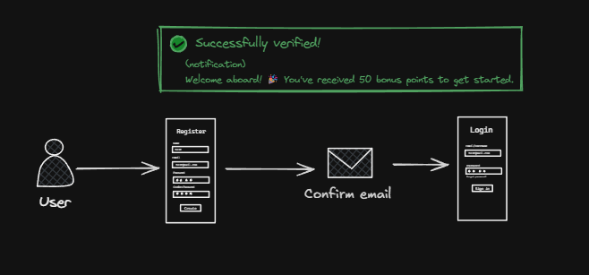
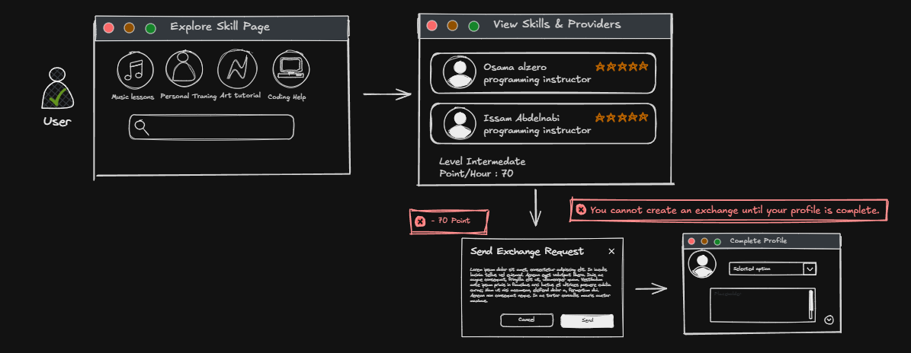
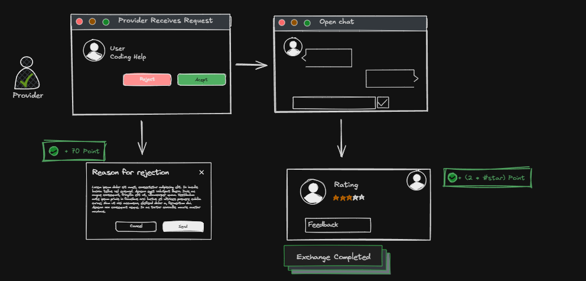

# 📌 Sharik – Skill Exchange Platform

Sharik is a platform that enables users to exchange skills with each other.  
Users can offer skills they have, request skills they want to learn, and engage in mutual learning through a structured exchange system with points and ranking.

---

## 🚀 Features
- User authentication and profile management  
- Skill and category management  
- Skill exchange workflow between users  
- Rating system after exchanges  
- Points and ranking system  
- Real-time chat between users  
- Real-time notifications  

---

## ⚙️ Tech Stack
- **Backend:** .NET 10, ASP.NET Core  
- **Architecture:** Clean Architecture, CQRS  
- **Database:** PostgreSQL, EF Core  
- **Authentication:** Identity, JWT, Refresh Tokens  
- **Real-Time:** SignalR  
- **Email Service:** MailKit  

---

## 🧠 Key Implementations
- Implemented CQRS pipeline behaviors for validation and caching  
- Applied hybrid caching (in-memory + PostgreSQL) to improve performance  
- Built background jobs to clean unverified users  
- Implemented audit interceptors (CreatedAt, UpdatedAt)  
- Added soft delete mechanism using interceptors  
- Designed a scalable and maintainable system following best practices  

---

## 🔐 Security
- JWT authentication with refresh token mechanism  
- Role-based authorization  
- Email confirmation using MailKit  
- Request validation  

---

## 📡 Real-Time System
- One-to-one chat using SignalR  
- Instant notifications for exchanges and updates  

---

## 📈 Architecture Overview
The system follows Clean Architecture principles with clear separation of concerns:
- Domain layer for business logic  
- Application layer using CQRS  
- Infrastructure layer for external services  
- API layer for endpoints  

---

## 🎯 Goals
- Build a scalable and maintainable backend system  
- Apply real-world architecture patterns  
- Implement real-time communication and background processing  
- Ensure security and performance  
---
## 🔧 Platform Flow

### 🔑 Authentication Flow

### 👤 User Flow

### 🧑‍💼 Provider Flow

